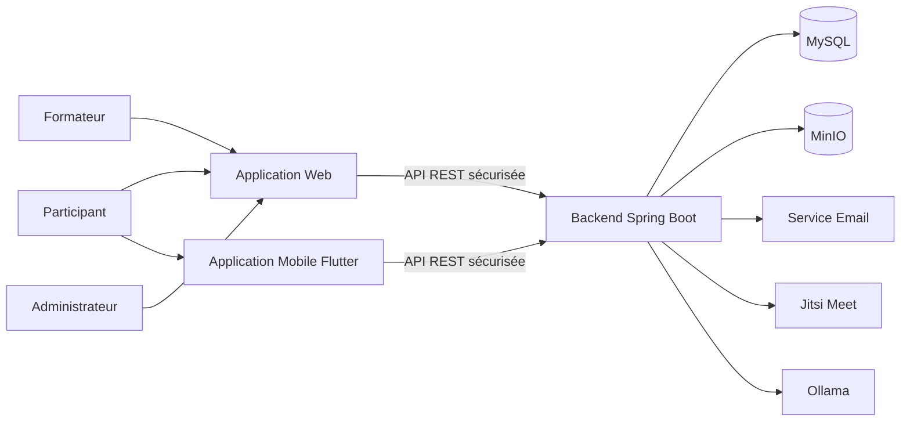
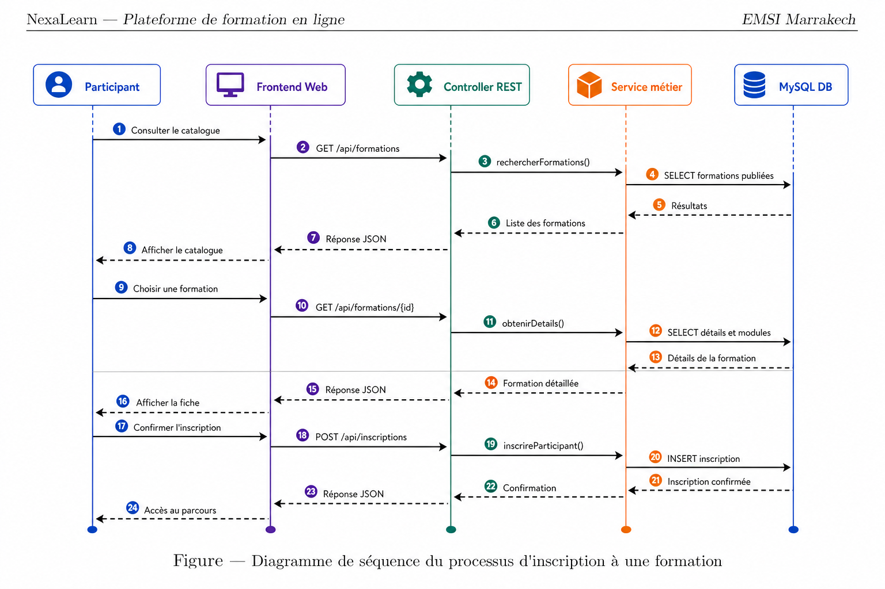

<div align="center">
  

  # 🎓 Khotwa — Plateforme intelligente d'apprentissage en ligne

  **Apprendre. Évoluer. Avancer, une étape à la fois.**
</div>

## 🌍 Contexte

La transformation numérique a profondément changé les méthodes d'apprentissage. Les apprenants recherchent aujourd'hui des formations accessibles à distance, structurées selon leur niveau et adaptées à leur rythme. Les formateurs ont, quant à eux, besoin d'outils permettant de créer des contenus pédagogiques, d'évaluer les acquis et d'accompagner efficacement leurs participants.

Dans ce contexte, **Khotwa** est une plateforme e-learning Web et Mobile conçue pour centraliser l'ensemble du parcours de formation. Elle permet de découvrir des cours, apprendre progressivement, passer des évaluations, rejoindre des classes virtuelles et obtenir un certificat de réussite.

Le nom **Khotwa**, qui signifie « étape » en arabe, représente la philosophie du projet : accompagner chaque apprenant étape par étape vers le développement de nouvelles compétences.

---

## ❗ Problématique

Les solutions d'apprentissage traditionnelles présentent plusieurs limites :

- 📚 Contenus pédagogiques dispersés et parfois mal structurés.
- 🔍 Difficulté à trouver une formation adaptée à son niveau et à ses objectifs.
- 📉 Manque de suivi réel de la progression des participants.
- 📝 Évaluations peu intégrées au parcours d'apprentissage.
- 👨‍🏫 Communication limitée entre les formateurs et leurs apprenants.
- 📅 Organisation complexe des classes et séances à distance.
- 🔔 Absence de rappels et de notifications personnalisées.
- 🔒 Protection insuffisante des comptes et des ressources pédagogiques.
- 📊 Manque d'outils de supervision pour les administrateurs.

Ces limites peuvent réduire la motivation des participants, compliquer le travail des formateurs et empêcher l'administration d'avoir une vision fiable de l'activité de la plateforme.

---

## 💡 Solution proposée

**Khotwa** propose un environnement pédagogique complet organisé autour de trois profils : **Participant**, **Formateur** et **Administrateur**.

La plateforme réunit dans une seule solution :

- un catalogue dynamique de formations ;
- des parcours structurés en modules et chapitres ;
- des ressources PDF, vidéo et YouTube ;
- des quiz après les modules et une évaluation finale ;
- un suivi automatique de la progression ;
- des classes virtuelles avec Jitsi Meet ;
- des notifications internes et par email ;
- un conseiller pédagogique intelligent basé sur Ollama ;
- une application mobile avec lecture hors connexion ;
- des certificats PDF vérifiables.

---

## 🎯 Objectifs

- 🎓 Faciliter l'accès à des formations en ligne complètes et organisées.
- 🔎 Aider les utilisateurs à trouver la formation correspondant à leurs besoins.
- 📚 Permettre un apprentissage progressif par modules et chapitres.
- ✅ Vérifier les connaissances grâce à des quiz corrigés côté serveur.
- 📈 Suivre la progression réelle de chaque participant.
- 👨‍🏫 Fournir aux formateurs un atelier complet de création et de suivi pédagogique.
- 🎥 Intégrer des classes virtuelles et des séances en direct.
- 🔔 Informer les utilisateurs grâce à des notifications fiables et personnalisées.
- 🏆 Générer un certificat après validation complète du parcours.
- 🤖 Proposer une orientation intelligente sans dépendre d'une API IA payante.
- 🔐 Garantir la confidentialité, la sécurité et la traçabilité des opérations.
- 📱 Offrir une expérience cohérente sur ordinateur, tablette et mobile.

---

## 👥 Acteurs de la plateforme

### 👨‍🎓 Participant

Le Participant est l'utilisateur qui souhaite développer ses compétences et suivre une formation.

Il peut :

- créer un compte et se connecter de manière sécurisée ;
- compléter ses préférences et ses objectifs d'apprentissage ;
- rechercher et filtrer les formations du catalogue ;
- consulter les programmes et les aperçus gratuits ;
- choisir une offre d'accès et s'inscrire à une formation ;
- lire les PDF, vidéos et ressources YouTube ;
- reprendre son cours à partir de sa dernière position ;
- télécharger les contenus autorisés pour les consulter hors connexion ;
- enregistrer des notes, signets et favoris ;
- suivre sa progression et ses objectifs hebdomadaires ;
- passer les quiz de modules et le quiz final ;
- consulter immédiatement son résultat ;
- rejoindre les classes virtuelles auxquelles il est affecté ;
- recevoir des notifications et des rappels ;
- publier un avis après une progression suffisante ;
- télécharger son certificat après validation complète de la formation.

### 👨‍🏫 Formateur

Le Formateur conçoit les parcours pédagogiques et accompagne les participants.

Il peut :

- créer et modifier son profil professionnel ;
- créer une formation et définir sa tarification ;
- organiser le contenu en modules, chapitres et ressources ;
- ajouter des couvertures, PDF, vidéos et liens YouTube ;
- proposer un aperçu gratuit contrôlé ;
- créer les questions et réponses des quiz ;
- publier, dépublier ou archiver ses formations ;
- créer des classes et définir leur capacité ;
- affecter les participants éligibles ;
- planifier, replanifier et annuler les séances ;
- détecter les conflits de planning ;
- consulter les données réelles d'engagement ;
- répondre aux avis laissés sur ses formations ;
- présenter ses formations dans un profil public.

### 👨‍💼 Administrateur

L'Administrateur supervise la plateforme, ses utilisateurs et ses contenus sensibles.

Il peut :

- consulter un tableau de bord alimenté par les données réelles ;
- visualiser les nombres de Participants, Formateurs et formations ;
- gérer les comptes utilisateurs ;
- modifier, suspendre ou bloquer un compte ;
- accepter ou refuser une candidature Formateur ;
- conserver la date, le motif et l'auteur de chaque décision ;
- consulter et traiter les avis signalés ;
- masquer ou republier un avis après modération ;
- superviser les notifications administratives ;
- consulter l'historique des opérations importantes.

---

## 🤖 Conseiller pédagogique intelligent

Khotwa intègre un assistant d'orientation capable d'aider un visiteur avant même son inscription.

Contrairement à un simple questionnaire statique, le conseiller peut :

- comprendre les questions rédigées en langage naturel ;
- identifier les objectifs professionnels ou pédagogiques ;
- prendre en compte le niveau et les préférences de l'utilisateur ;
- répondre aux questions concernant les formations ;
- recommander uniquement les cours réellement disponibles ;
- expliquer les raisons de chaque recommandation ;
- continuer à proposer des résultats si le modèle d'intelligence artificielle est indisponible.

L'intelligence artificielle fonctionne localement avec **Ollama**. Cette solution gratuite évite l'utilisation d'une API externe payante et permet de conserver le contrôle de l'infrastructure.

---

## 📚 Parcours pédagogique

Une formation Khotwa suit une organisation claire :

```text
Formation
├── Module 1
│   ├── Chapitre 1
│   │   ├── Cours PDF ou vidéo
│   │   └── Ressource complémentaire
│   ├── Chapitre 2
│   └── Quiz de fin de module
├── Module 2
│   ├── Chapitres et ressources
│   └── Quiz de fin de module
└── Quiz final
    └── Certificat de réussite
```

Le Participant avance dans un ordre contrôlé. La validation des chapitres et la réussite des quiz obligatoires déterminent son éligibilité au certificat. Les réponses correctes sont calculées et protégées par le backend.

---

## ⭐ Fonctionnalités principales

- 🔐 Authentification JWT et gestion des rôles.
- 📖 Catalogue dynamique de formations.
- 🎬 Lecteur intégré pour PDF, vidéos et YouTube.
- 📱 Application Flutter Android et iOS.
- 📥 Consultation hors ligne des ressources autorisées.
- 🧠 Quiz par module et quiz final.
- 📊 Progression, reprise de lecture et objectifs.
- 📝 Notes privées, signets, favoris et avis.
- 🎥 Classes virtuelles sécurisées avec Jitsi Meet.
- 🔔 Notifications internes et emails avec préférences.
- ♻️ Envoi durable des emails avec reprise en cas d'échec.
- 🗂️ Stockage privé des fichiers dans MinIO.
- 🏆 Génération de certificats PDF Khotwa.
- 🤖 Orientation intelligente avec Ollama.
- 🛡️ Modération des avis et administration des comptes.
- 🌙 Thèmes clair et sombre.
- ♿ Interface responsive et accessible.

---

## 🛠️ Technologies utilisées

### Backend

- **Java 21**
- **Spring Boot**
- **Spring Security**
- **JWT**
- **Spring Data JPA**
- **Hibernate**
- **Maven**
- **OpenAPI / Swagger**
- **Apache PDFBox**

### Frontend Web

- **Next.js 16**
- **React 19**
- **TypeScript**
- **Tailwind CSS**
- **PDF.js**
- **Lucide React**

### Application Mobile

- **Flutter**
- **Dart**
- **Flutter Secure Storage**
- **WebView**
- **Lecteur PDF et vidéo**
- **SDK Jitsi**
- **Gestion hors connexion**

### Données et infrastructure

- **MySQL 8.4**
- **Flyway**
- **MinIO**
- **Mailpit**
- **Jitsi Meet**
- **Ollama**
- **Docker Compose**

### Tests et qualité

- **JUnit 5**
- **Mockito**
- **Vitest**
- **Testing Library**
- **Flutter Test**
- **JaCoCo**
- **ESLint**
- **SonarQube Cloud**

---

## 🏗️ Architecture générale

Khotwa utilise une architecture distribuée composée de plusieurs applications et services :



Le backend centralise les règles métier et de sécurité. Les applications Web et Mobile communiquent avec lui à travers une API REST. MySQL conserve les données métier, tandis que MinIO protège les fichiers pédagogiques.

---

## 🔒 Sécurité et fiabilité

- Mots de passe hachés avec BCrypt.
- Authentification sécurisée par JWT.
- Autorisations contrôlées selon le rôle.
- Contrôle du propriétaire des ressources.
- Tokens de réinitialisation temporaires et à usage unique.
- Ressources MinIO privées.
- URLs temporaires délivrées après contrôle serveur.
- Réponses des quiz non divulguées avant la soumission.
- Verrous et contraintes d'unicité pour les opérations concurrentes.
- Notifications et emails idempotents.
- Mécanisme de retry en cas de panne email.
- Nettoyage résilient des objets supprimés.
- Historique des décisions administratives.
- Migrations Flyway pour l'évolution de la base de données.

---

## 📌 Structure du projet

```text
E-learning/
├── backend/
│   ├── src/main/java/
│   ├── src/main/resources/
│   └── src/test/
│
├── web/
│   ├── app/
│   ├── components/
│   ├── lib/
│   ├── public/
│   └── tests/
│
├── mobile/
│   ├── lib/
│   ├── assets/
│   └── test/
│
├── docs/
├── docker-compose.yml
└── sonar-project.properties
```

---

## 📌 Diagrammes UML

### Diagramme de séquence — Inscription

<div align="center">
  
</div>

Les autres diagrammes de conception peuvent être ajoutés dans cette section :

- diagramme de cas d'utilisation ;
- diagramme de classes ;
- diagrammes de séquence ;
- diagramme de composants ;
- diagramme de déploiement.

---

## 📊 Qualité logicielle

Le projet applique une démarche de qualité couvrant les trois applications :

- ✅ Tests unitaires et tests d'intégration Backend.
- ✅ Tests des interfaces et interactions Web.
- ✅ Tests des fonctionnalités Mobile.
- ✅ Couverture Java avec JaCoCo.
- ✅ Couverture TypeScript avec Vitest.
- ✅ Analyse statique avec SonarQube Cloud.
- ✅ Validation TypeScript et ESLint.
- ✅ Vérification des migrations Flyway.
- ✅ Tests de concurrence sur les opérations critiques.
- ✅ Contrôles responsive et accessibilité.
- ✅ Validation des thèmes clair et sombre.

---

## ⚠️ Limites actuelles

- Le paiement est simulé et aucune donnée bancaire réelle n'est traitée.
- Khotwa contrôle l'accès à Jitsi, mais les droits de modération dépendent de l'instance utilisée.
- Le téléchargement hors ligne ne constitue pas un système DRM.
- Ollama doit être installé localement pour produire les réponses génératives.
- La compilation et la signature iOS nécessitent macOS et Xcode.

---

## 🚀 Perspectives

- 💳 Intégrer une solution de paiement réelle et sécurisée.
- 📱 Publier l'application sur Google Play et App Store.
- 💬 Ajouter une messagerie directe entre Participant et Formateur.
- 📹 Étudier l'enregistrement des classes virtuelles.
- 🧠 Enrichir le conseiller avec davantage de modèles et de langues.
- 📊 Ajouter des analyses pédagogiques prédictives.
- 🌍 Proposer une interface en français, arabe et anglais.
- ☁️ Préparer un déploiement Cloud avec supervision centralisée.

---

## 👨‍💻 Auteur

| Nom | Rôle |
|---|---|
| **Hatim KOUBRI** | Conception et développement Full Stack |

Projet individuel réalisé dans le cadre d'un stage en **Ingénierie Informatique et Réseaux**, spécialité **Développement Digital et Systèmes d'Information**.

---

<div align="center">
  <strong>Khotwa — Chaque compétence commence par une première étape.</strong>
</div>
